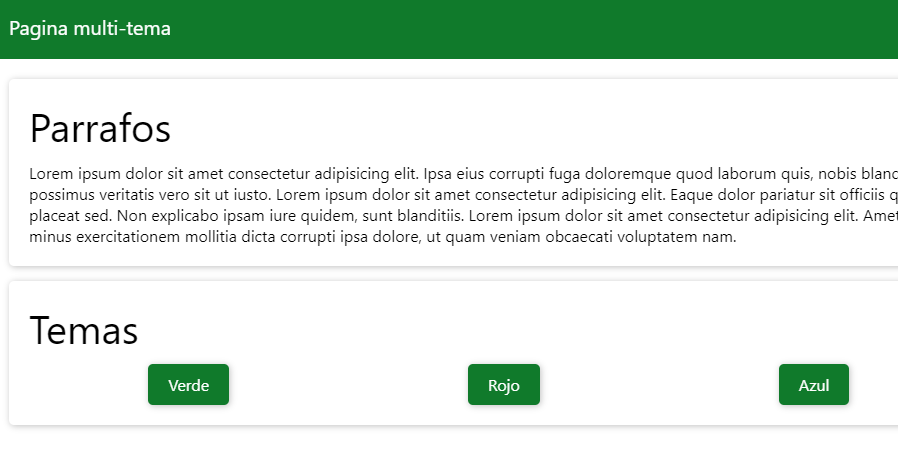

# Ejemplos de modo nocturno en CSS con JS. 

> Por medio del siguiente programa podemos tener distintos estilos en una página web como lo es el modo nocturno y un variedad tremenda de colores al tiempo que puedes permitir a tus usuarios crear sus propios temas.

